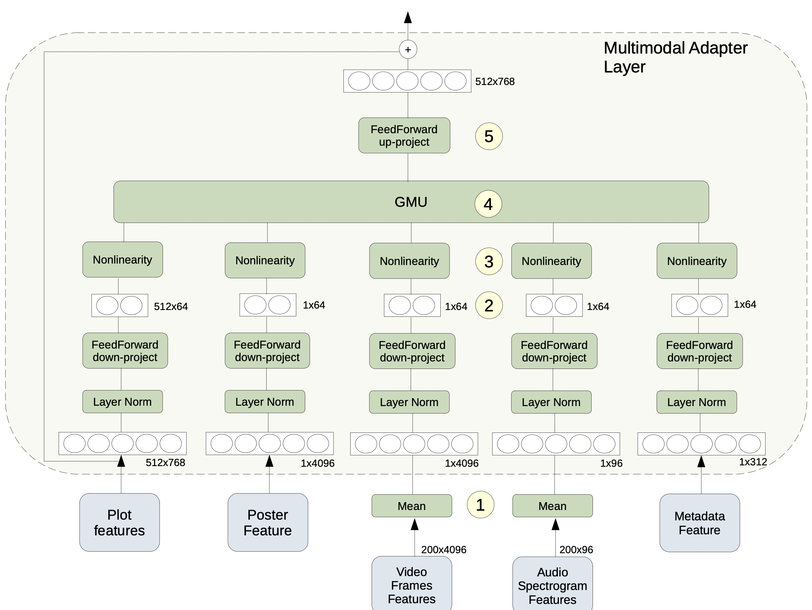

# Multimodal-Adapters

Adapter modules with support for multimodal fusion of information (text, video, audio, etc.) using pre-trained BERT base model. For a more detailed review of the architecture, refere to my [master thesis pdf](https://cimat.repositorioinstitucional.mx/jspui/bitstream/1008/1126/1/TE%20832.pdf). In section 4.2 "Parameter-Efficient Transfer Learning for Multimodal Tasks" I describe the architectural changes made in order for the BERT model to support multimodal inputs.

A journal paper is on the way to present some interesting results with this architecture.

## Experiments

The proposed architecture was used to perform experiments with a movie genre multimodal classification task ([Moviescope](https://www.cs.virginia.edu/~pc9za/research/moviescope.html)). Multimodal-Adapter was compared with [MMBT](https://arxiv.org/abs/1909.02950), showing on par performance with a significant reduction in the number of parameters modified during finetuning. For more details about the experiments please refer section 5.5 "Multimodal Adapter Experiments" [here](https://cimat.repositorioinstitucional.mx/jspui/bitstream/1008/1126/1/TE%20832.pdf).

## Multimodal Adapter Architecture

The text input, is represented by the BERT hidden vectors $H \in \mathbb{R}^{l \times 768}$ where $l$ is the text sequence length, and $m$ extra modalities ($m=4$ for the shown example). Given that the GMU module receives one vector per modality, for modalities that consist in a sequence of features (like video frames or audio spectrogram), we take the average of the sequence's elements before taking them as input to the Multimodal Adapter layer, as shown in point 1 in diagram. Once we have a single vector per modality (except for text) $M_i \in \mathbb{R}^{d_i}$ where $d_i$ represents the modality's dimension, we take the same approach as Houlsby2019 for each modality, i.e., we apply a Normalization layer together with a FeedForward down-project to reduce the vector dimension to $p$ (in this case dimension $p=64$) at point 2 of diagram, and finally apply a non-linear activation function at point 3. Unlike the original Adapter, where the FeedForward up-project is applied right after the non-linearity, here we first combine the different modalities inside the GMU module, as shown in point 4 of diagram, and once we have fused them all, we apply the FeedForward up-project to the original BERT hidden dimension (768) and add the information from the skip connection, as indicated in point 5 of the diagram.

## Experiments based on:

* [Adapters](https://arxiv.org/abs/1902.00751): Parameter-Efficient Transfer Learning for NLP" by Houlsby et al.

* [Adapter Fusion](https://arxiv.org/abs/2005.00247): AdapterFusion: Non-Destructive Task Composition for Transfer Learning" by Pfeiffer et al.

* [MMBT](https://arxiv.org/abs/1909.02950): Supervised Multimodal Bitransformers for Classifying Images and Text
 by Kiela et al.
 
* [GMU](https://arxiv.org/abs/1702.01992) Gated Multimodal Units for Information Fusion by Arevalo et al.

* [Moviescope](https://arxiv.org/abs/1908.03180): Moviescope: Large-scale Analysis of Movies using Multiple Modalities by Cascante-Bonilla et al.
